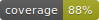

 

# Aplikace pro výpočet daně z příjmů fyzických osob

## Úvod

Vítejte v repozitáři webové aplikace pro výpočet daně z příjmů fyzických osob. Tato webová aplikace byla vytvořena s cílem zjednodušit a zpřístupnit proces výpočtu daně z příjmů pro účetní a širokou veřejnost v České republice. Aplikace je určena pro jednotlivce, kteří chtějí rychle, efektivně a správně vypočítat svou daňovou povinnost.

## Funkcionalita

Aplikace nabízí následující funkce:

- **Výpočet daně z příjmů:** Umožňuje uživatelům vypočítat výši daně na základě různých příjmů.
- **Přehledné uživatelské rozhraní:** Nabízí jednoduché a intuitivní ovládání pro všechny uživatele.
- **Přehled historie výpočtů:** Obsahuje intuitivní historie uživatelských výpočtů. 
- **Aktualizované daňové tabulky:** Zahrnuje nejnovější daňové sazby a úlevy.

## Technologie

Aplikace je vyvinuta s využitím moderních technologií:

- **Frontend:** HTML5, CSS3, JavaScript
- **Backend:** Django (Python)
- **Databáze:** SQLite

## Instalace

Pro spuštění aplikace na lokálním stroji postupujte podle následujících kroků:

1. Nainstalujte docker: https://www.docker.com/

2. Naklonujte repozitář do vašeho lokálního stroje:
   
   git clone https://github.com/VnislavMatousek/MP-projekt.git

3. Přejděte do složky s projektem přes příkazovou řádku:

   cd MP-Projekt

4. Použijte příkaz **docker compose build** pro spuštění aplikace
   
5. Spusťte databázové migrace:
   
   **./run.sh migrate**

4. Spusťte Django server:

   **docker compose up**

Po spuštění serveru je aplikace dostupná na portu `8100`.

## Použití

Po spuštění aplikace můžete přistoupit k výpočtu vaší daně z příjmů. Stačí zadat relevantní informace do formuláře a aplikace vypočítá vaši daňovou povinnost.

## Přispění

Jsme otevřeni jakýmkoliv připomínkám nebo příspěvkům. Pokud máte návrh na vylepšení nebo jste našli chybu, neváhejte vytvořit nový issue nebo pull request.

## Licence

Tento projekt je distribuován pod [MIT licencí](LICENSE).

## Poděkování

Děkujeme všem přispěvatelům a uživatelům této aplikace a těšíme se na vaše návrhy a připomínky.
